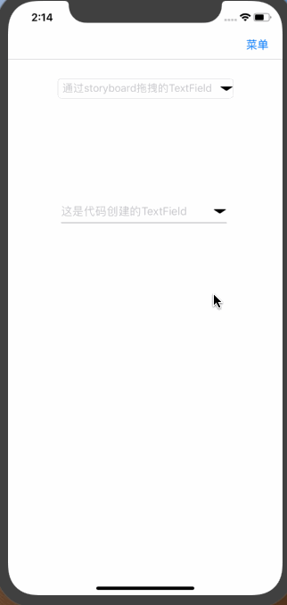

# Swift 下拉选择框

## I 思路

以`TableView`为基础，提供一个可以灵活地实现文本输入选择、菜单选择的下拉框。



## II 使用

#### 支持 TextField

如果你希望为已有的一个`TextField`添加下拉选择的功能，那这真的十分适合你，这里面提供的`DropBoxTextField`能够很好地兼容你现有的文本输入框。

你以前的代码可能是这样的：
```
let textField = UITextField(frame: ...)
// 省略一些代码
self.view.addSubview(textField)
```

只需要做如下的修改就能很好地兼容上面的代码：
```
let textField = UITextField()
// 省略一些代码
let dropBoxTextField = DropBoxTextField(frame:..., textField: textField)
self.view.addSubview(dropBoxTextField)
```
就像装饰者模式一样，我们为你的`TextField`增加了下拉框的功能，你之前对它的一切定制仍然生效，也许会有一些布局上的影响，但相信你能很好地解决，这难不倒你。

## III 可能存在的问题

为什么我展开后的下拉框被挡住了？

答：这种情况是常有的，因为下拉框 `DropBoxTextField` 添加到父View时可能位于其他子View的下层。你可以为可能展开的下拉框预留一些空间，如果不能，你可以在父view调用`bringSubviewToFront(UIView)`让下拉框始终保持在最前面。

## IV 其他

如果你还有别的问题或者改进可以通过issue或者邮件通知我们，如果我们的代码或者思路帮助到你的开发，请为我们的项目留下你的star。

###### Copyright © 2019 - 2020 许家乐


