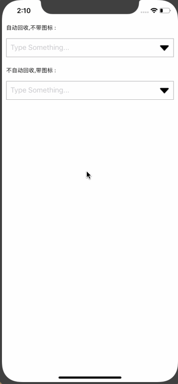

## Swift 下拉选择框

### I 思路

以`TableView`为基础，提供一个可以灵活地实现文本输入选择、菜单选择的下拉框。

<p>
    
    
</p>
第一张效果图展示了从StoryBoard直接拖拽`TextField`、通过代码添加`TextField`和结合菜单键实现菜单的三种效果。

第二张效果图来源于我们开源的一个课程作业项目，我们应用下拉框来实现账号列表的功能，有兴趣的同学可以到 (github.com/XuJiaLe1997/BookShopIOS)[https://github.com/XuJiaLe1997/BookShopIOS] 这个仓库参考一下，可以直接运行，不需要服务器。

### II 使用

如果你希望为已有的一个`TextField`添加下拉选择的功能，那这真的十分适合你，这里面提供的`DropBoxTextField`能够很好地兼容你现有的文本输入框。

你以前的代码可能是这样的：
```
let textField = UITextField(frame: ...)
// 省略一些代码
self.view.addSubview(textField)
```

只需要做如下的修改就能很好地兼容上面的代码：
```
let textField = UITextField(frame: ...)
// 省略一些代码
let dropBoxTextField = DropBoxTextField(textField: textField, delegate: self)
self.view.addSubview(dropBoxTextField)
```
就像装饰者模式一样，我们为你的`TextField`增加了下拉框的功能，你之前对它的一切定制仍然生效，也许会有一些布局上的影响，但相信你能很好地解决，这难不倒你。

我们支持你的`TextField`从StoryBoard中直接拖拽，但注意不要直接在StoryBoard添加约束，这会影响到我们装饰它。实际上，直接拖拽文本框并不是一种很好的做法，我们建议你使用代码的方式。

如果你希望实现一个菜单下拉，这也是一种不错的选择，在我们提供的Demo中就有类似的例子。但由于时间原因，我们没有很认真地去实现这种做法，你需要根据需求定制菜单的下拉样式，这很简单，在我们的代码注释中对样式修改的部分十分清晰。

### III 可能存在的问题

为什么我展开后的下拉框被挡住了？

答：这种情况是常有的，因为下拉框添加到父识图时可能位于其他子识图的下层。你可以为可能展开的下拉框预留一些空间，如果不能，你可以在父view调用`bringSubviewToFront(UIView)`让下拉框始终保持在最前面。

### IV 其他

如果你还有别的问题或者改进可以通过issue或者邮件通知我们，如果我们的代码或者思路帮助到你的开发，请为我们的项目留下你的star。

###### Copyright © 2019 - 2020 许家乐


